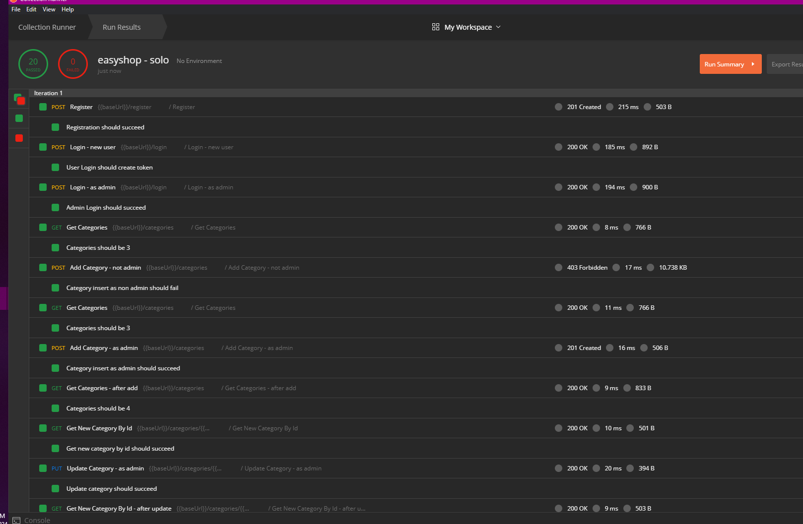
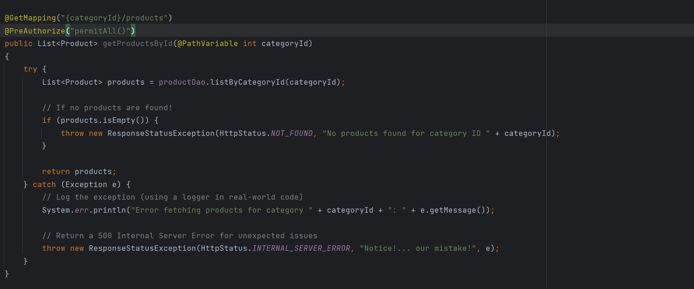
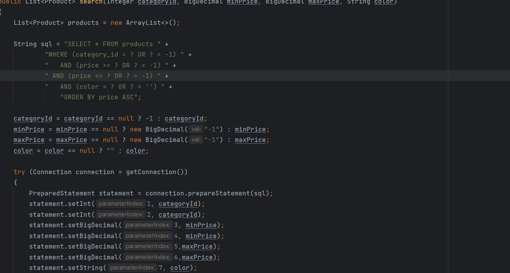
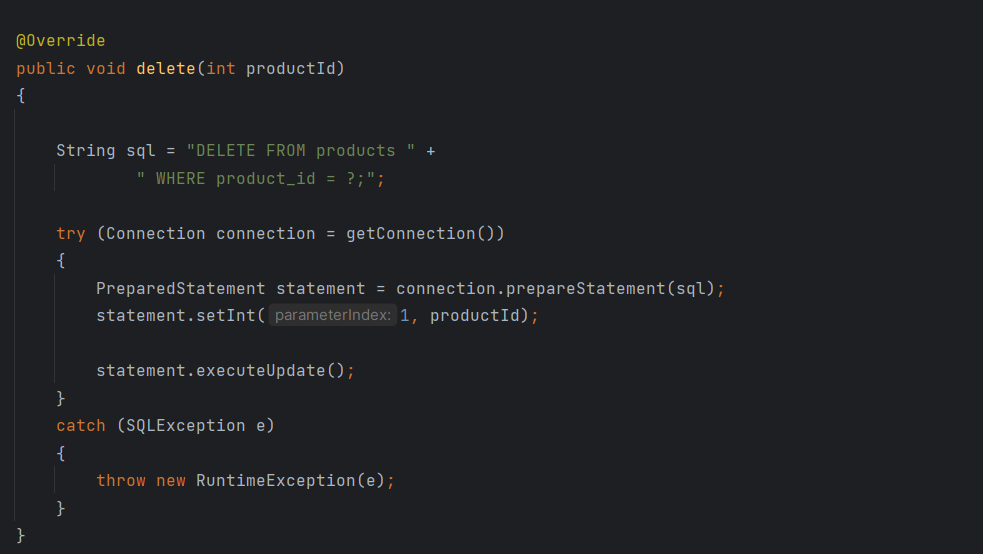
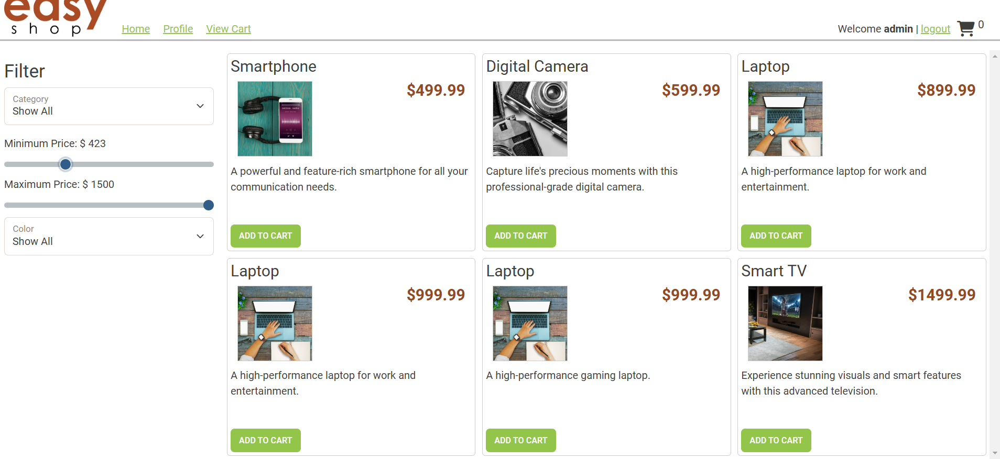
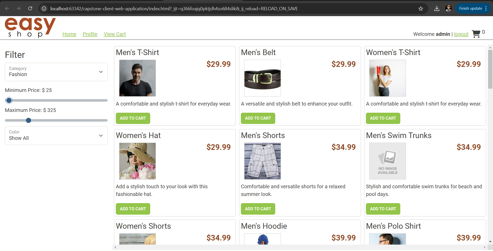

# Easy-Shop-API

Hello here is a brief description of my EasyShop API: Imagine an online store with a wide range of products, all accessible through a simple, easy-to-use interface.
This project is to show how I am implementing the REST standards into EasyShop Application.

## Description of the Project
This API is the next generation of online shopping! Designed for both industries and personal use, it offers fast loading and seamless filtering for an efficient and smooth shopping experience.

, , ,,,

## User Stories
- As a developer, I want to implement a structured organized Categories Controller.

- As a Developer, I will need to fix up couple bugs within Product Controller.

- AS a Developer, ensure that my application is following the REST API standards.

- As a Developer, I want to the products to filter through Asc or Desc order.

## Setup

Instructions on how to set up and run the project using IntelliJ IDEA.

### Prerequisites

- IntelliJ IDEA: Ensure you have IntelliJ IDEA installed, which you can download from [here](https://www.jetbrains.com/idea/download/).
- Java SDK: Make sure Java SDK is installed and configured in IntelliJ.
- Mysql : Make sure it is up-to-date, and connected to your Intellij project.

### Running the Application in IntelliJ

Follow these steps to get your application running within IntelliJ IDEA:

1. Open IntelliJ IDEA.
2. Select "Open" and navigate to the directory where you cloned or downloaded the project.
3. After the project opens, wait for IntelliJ to index the files and set up the project.
4. Find the main class with the `public static void main(String[] args)` method.
5. Right-click on the file and select 'Run 'YourMainClassName.main()'' to start the application.
6. Rerun and refresh the SQL database
7. Check postman and ensure you are all green.
8. Then jump into the client web application and run this through Scary Google Chrome.

## Technologies Used

- Java: Mention the version you are using.
- Any additional libraries or frameworks used in the project.
- Spring initializer.
- Maven Repository.
- Git-Hub for listing out all my tasked within a kanban board.
## Future Work

Outline potential future enhancements or functionalities you might consider adding:

- Improve a friendly user experience.
- Take on the frontend and improve fonts and features with in website.
- implement A receipt builder into backend.

## Resources

List resources such as tutorials, articles, or documentation that helped you during the project.

- W3Schools
- HTTP status Fish API: to see my errors codes and what they are.

## Team Members

- **Devin** - Motivation and support.

## Thanks

Express gratitude towards those who provided help, guidance, or resources:

- Thank you to [Raymond] for continuous support and guidance.
- A special thanks to all teammates for their dedication and teamwork.
